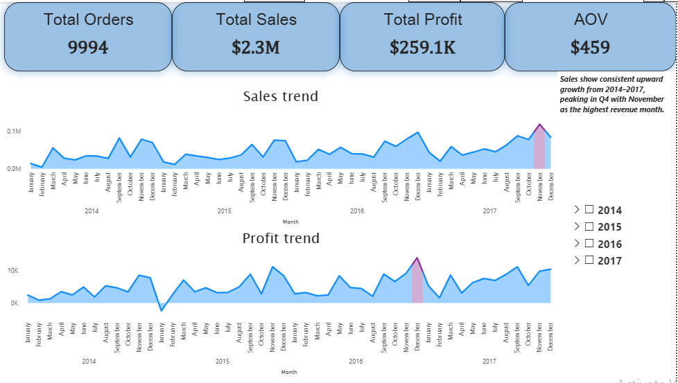
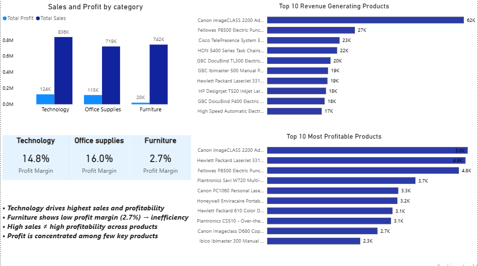

# Superstore-Sales-Analysis
Analyzed retail sales data using SQL, Excel, and Power BI to uncover profit trends, top-performing products, and actionable business insights.
# Superstore Sales & Profit Analysis

## 📌 Problem Statement
Analyze retail sales data to identify key drivers of revenue and profit, detect loss-making products, and uncover trends that can support business decision-making.

---

## 📊 Dataset Description
The dataset contains order-level sales data including:
- Sales
- Profit
- Category & Sub-category
- Product Name
- Order Date
- Region

---

## 🎯 Key KPIs
- Total Sales
- Total Profit
- Profit Margin
- Number of Orders
- Average Order Value

---

## 📈 Dashboard Overview
The Power BI dashboard includes:
- Sales & Profit trends over time
- Category-wise performance
- Top 10 products by sales and profit
- Profitability insights

### Dashboard Screenshots

#### Page 1 – Sales & Profit Trends

#### Page 2 – Category & Product Insights

---

## 🔍 Key Insights
- Technology category drives the highest revenue but moderate profitability
- Several products show high sales but negative profit → pricing inefficiencies
- Sales show seasonal trends with identifiable peak periods
- Top products contribute disproportionately to total revenue

---

## 💡 Business Recommendations
- Focus on high-margin categories to improve profitability
- Re-evaluate pricing strategies for loss-making products
- Leverage seasonal trends for targeted marketing campaigns

---

## 🛠️ Tools Used
- SQL (Data analysis & querying)
- Excel (Data cleaning)
- Power BI (Data visualization & dashboarding)

---

